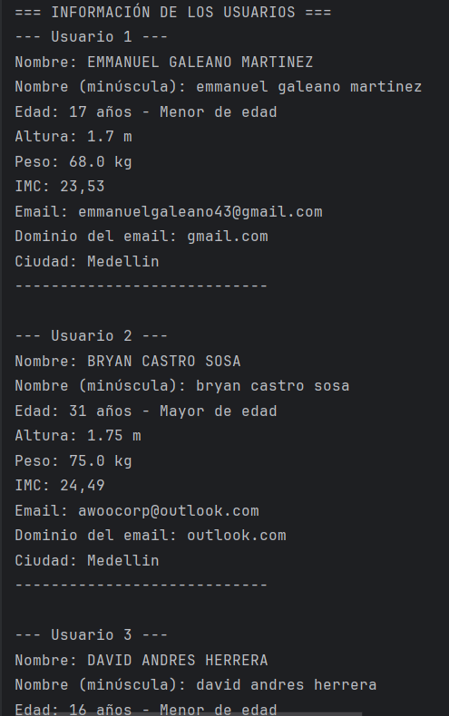

# 👨‍💻 Proyecto Kotlin - Gestor de Información Personal
**Autor:** Emmanuel Galeano Martínez

---

## 📋 Descripción

Este proyecto es una **aplicación de consola escrita en Kotlin** que permite registrar, validar y analizar información personal de varios usuarios. Se desarrollo como práctica para reforzar el uso de:

- Variables y constantes
- Tipos de datos
- Operadores aritméticos, lógicos y relacionales
- Validaciones y manipulación de cadenas
- Estructuras básicas del lenguaje Kotlin

---

## 🛠️ Funcionalidades

- ✅ Registro de al menos **3 usuarios**
- ✅ Validación de:
    - Edad (> 0)
    - Altura y peso (> 0)
    - Email válido (contiene `@` y `.`)
- ✅ Cálculo del **IMC** (Índice de Masa Corporal)
- ✅ Detección de **mayoría de edad**
- ✅ Manipulación de cadenas:
    - Nombre en mayúsculas y minúsculas
    - Extracción del dominio del email
    - Generación de un resumen con string templates

---

## 🚀 Cómo ejecutar el proyecto

1. Abre el proyecto en el editor de codigo **IntelliJ IDEA**.
2. Ejecuta el archivo `main.kt`.
3. Ingresa los datos solicitados por consola.
4. Observa los resultados al final del registro.

---

## 💻 Ejemplo de Ejecución

### 📝 Registro de usuarios
Click en la imagen para abrirla (CTRL + CLICK)

---

### 📊 Información de usuarios
Click en la imagen para abrirla (CTRL + CLICk)

---

## 📁 Estructura del proyecto

Gestor De Informacion Personal en Kotlin/
├── src/
│ ├── main.kt
│ └── User.kt
├── README.md
├── img.png
└── img_1.png

---

## 🌐 Repositorio GitHub

Este proyecto fue subido al repositorio público:  
👉 [https://github.com/EmmanuelGaleano/Kotlin-Gestor-InfoPersonal](https://github.com/EmmanuelGaleano/Kotlin-Gestor-InfoPersonal) *(reemplazar con tu URL real)*

---

## 📌 Créditos

Desarrollado por **Emmanuel Galeano Martínez**  
Programa de Formación: **Análisis y Desarrollo de Software – SENA**
Ficha: ADSO 3144585

---

